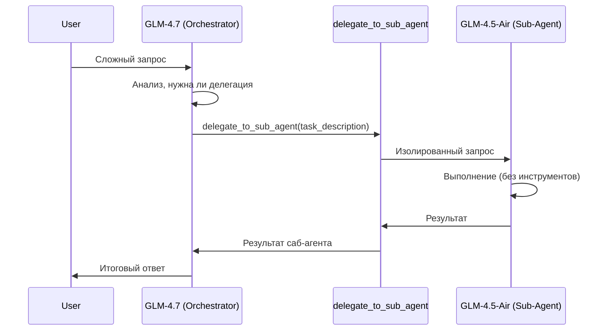

# Sub-Agent Delegation Feature

Добавление возможности оркестратору (GLM-4.7 CoT) делегировать черновую работу саб-агенту (GLM-4.5-Air) через новый инструмент `delegate_to_sub_agent`.

## Архитектура



## User Review Required

> [!IMPORTANT]
> **Ограничения MVP**:
> - Саб-агент работает **без инструментов** (чистый LLM, без tool calling)
> - Одна модель саб-агента: `glm-4-5-air` (ZAI)
> - Саб-агент не имеет доступа к памяти/истории оркестратора

> [!WARNING]  
> Потенциальные риски:
> - Дополнительная задержка (вызов второй LLM)
> - Увеличение стоимости API-запросов

---

## Proposed Changes

### Agent Providers

#### [NEW] [delegation.rs](file:///home/stfu/ai/Another-Chat-with-LLM/src/agent/providers/delegation.rs)
Провайдер инструмента `delegate_to_sub_agent`:
- **Параметры инструмента**:
  - `task`: строка — описание задачи для саб-агента
  - `context`: опционально — дополнительный контекст
- **Логика**: создаёт `LlmClient` с моделью саб-агента, отправляет запрос, возвращает результат
- **Конфигурация**: модель читается из `config.rs` или ENV

---

### Configuration

#### [MODIFY] [config.rs](file:///home/stfu/ai/Another-Chat-with-LLM/src/config.rs)
Добавить:
```diff
+/// Model for sub-agent delegation (lightweight CoT)
+pub const SUB_AGENT_MODEL_ZAI: &str = "ZAI GLM-4.5-Air";
+
+/// Get sub-agent model from env or default
+pub fn get_sub_agent_model() -> &'static str {
+    // SUBAGENT_MODEL env var or default
+}
```

Добавить модель в `MODELS`:
```rust
(
    "ZAI GLM-4.5-Air",
    ModelInfo {
        id: "glm-4-5-air", 
        max_tokens: 8192,
        supports_vision: false,
        provider: "zai",
        supports_tools: false, // Важно: без инструментов
    },
),
```

---

### Agent Module

#### [MODIFY] [mod.rs](file:///home/stfu/ai/Another-Chat-with-LLM/src/agent/providers/mod.rs)
Добавить экспорт нового провайдера:
```diff
+pub mod delegation;
```

#### [MODIFY] [registry.rs](file:///home/stfu/ai/Another-Chat-with-LLM/src/agent/registry.rs)
Зарегистрировать инструмент `delegate_to_sub_agent` с низким приоритетом.

---

### Skills

#### [NEW] [delegation.md](file:///home/stfu/ai/Another-Chat-with-LLM/skills/delegation.md)
Skill-файл для объяснения агенту когда и как использовать делегирование:

```markdown
---
name: delegation
description: Делегирование черновой работы саб-агенту
triggers: [делегиру, саб-агент, исполнитель, помощник, черновик]
allowed_tools: [delegate_to_sub_agent]
weight: medium
---
## Инструмент delegate_to_sub_agent

Используй для делегирования **изолированных подзадач**, которые:
- Не требуют доступа к инструментам (sandbox, файлы, поиск)
- Являются "черновой работой" (сбор фактов, переформулирование, расчёты)
- Могут быть выполнены без контекста основного диалога

### Когда использовать:
- Анализ длинного текста
- Извлечение структурированных данных
- Рерайт/переформулирование
- Простые вычисления

### Когда НЕ использовать:
- Задачи, требующие инструментов
- Задачи, зависящие от истории диалога
```

---

## Verification Plan

### Automated Tests
Существующие тесты в `tests/`:
- `tests/agent_test.rs` — можно расширить для проверки `delegation` tool

Новый тест:
```rust
#[tokio::test]
async fn test_delegate_to_sub_agent() {
    // Мок LlmClient, вызвать delegate_to_sub_agent, проверить результат
}
```

**Команда**: `cargo test test_delegate_to_sub_agent`

### Manual Verification
1. Запустить бота локально (`cargo run`)
2. Отправить запрос: *"Кратко опиши что такое Rust, делегируй чёрному агенту"*
3. Проверить: агент вызывает `delegate_to_sub_agent`, получает ответ, интегрирует в финальный ответ

---

## Альтернативные варианты (для обсуждения)

| Вариант | Описание | Плюсы | Минусы |
|---------|----------|-------|--------|
| **Текущий** | Отдельный LLM-вызов без tools | Простота, изоляция | Нет доступа к tools |
| **Вложенный Executor** | Саб-агент с полным циклом | Полные возможности | Сложность, рекурсия |
| **Специализированные саб-агенты** | Разные модели для разных задач | Гибкость | Сложная конфигурация |
