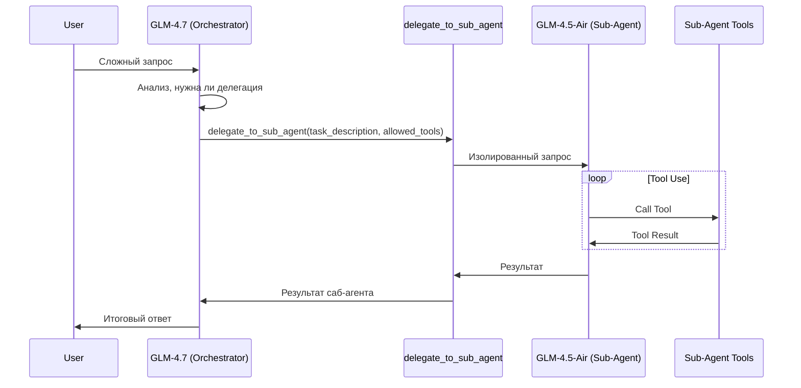

# Sub-Agent Delegation Feature

Добавление возможности оркестратору (GLM-4.7 CoT) делегировать черновую работу саб-агенту (GLM-4.5-Air) через новый инструмент `delegate_to_sub_agent`. Теперь саб-агент может использовать инструменты!

## Архитектура



## User Review Required

> [!IMPORTANT]
> **Особенности Implementation**:
> - Саб-агент работает **с поддержкой инструментов** (tool calling allowed)
> - Одна модель саб-агента: `glm-4-5-air` (ZAI)
> - Саб-агент имеет свой собственный изолированный контекст и сессию

> [!WARNING]  
> Потенциальные риски:
> - Дополнительная задержка (цепочка вызовов LLM + Tools)
> - Увеличение стоимости API-запросов (looping sub-agent)
> - Необходимость контроля бесконечных циклов в саб-агенте

---

## Proposed Changes

### Agent Providers

#### [NEW] [delegation.rs](file:///home/stfu/ai/oxide-agent/src/agent/providers/delegation.rs)
Провайдер инструмента `delegate_to_sub_agent`:
- **Параметры инструмента**:
  - `task`: строка — описание задачи для саб-агента
  - `context`: опционально — дополнительный контекст
  - `tools`: массив строк — список разрешенных инструментов (whitelist). Если пуст — базовый набор.
- **Логика**: 
  - Создаёт новую изолированную сессию (`Session`) для саб-агента.
  - Настраивает `LlmClient` с моделью саб-агента и переданными инструментами.
  - Запускает цикл выполнения (Agent Loop) для этой сессии.
  - Возвращает финальный ответ саб-агента.
- **Конфигурация**: модель читается из `config.rs` или ENV.

---

### Configuration

#### [MODIFY] [config.rs](file:///home/stfu/ai/oxide-agent/src/config.rs)
Добавить:
```diff
+/// Model for sub-agent delegation (lightweight CoT)
+pub const SUB_AGENT_MODEL_ZAI: &str = "ZAI GLM-4.5-Air";
+
+/// Get sub-agent model from env or default
+pub fn get_sub_agent_model() -> &'static str {
+    // SUBAGENT_MODEL env var or default
+}
```

Добавить модель в `MODELS`:
```rust
(
    "ZAI GLM-4.5-Air",
    ModelInfo {
        id: "glm-4-5-air", 
        max_tokens: 128000,
        supports_vision: false,
        provider: "zai",
        supports_tools: true, // Важно: поддержка инструментов включена
    },
),
```

---

### Agent Module

#### [MODIFY] [mod.rs](file:///home/stfu/ai/oxide-agent/src/agent/providers/mod.rs)
Добавить экспорт нового провайдера:
```diff
+pub mod delegation;
```

#### [MODIFY] [registry.rs](file:///home/stfu/ai/oxide-agent/src/agent/registry.rs)
Зарегистрировать инструмент `delegate_to_sub_agent`.

---

### Skills

#### [NEW] [delegation.md](file:///home/stfu/ai/oxide-agent/skills/delegation.md)
Skill-файл для объяснения агенту когда и как использовать делегирование:

```markdown
---
name: delegation
description: Делегирование задач саб-агенту (с возможностью использования инструментов)
triggers: [делегиру, саб-агент, исполнитель, помощник, исследование]
allowed_tools: [delegate_to_sub_agent]
weight: medium
---
## Инструмент delegate_to_sub_agent

Используй для делегирования **изолированных подзадач**, которые могут требовать использования инструментов (поиск, чтение файлов).

### Параметры:
- `task`: Описание задачи.
- `tools`: Список инструментов, необходимых саб-агенту (например: ["web_search", "read_file"]).

### Когда использовать:
- Поиск информации в интернете (делегируй "research" задачу)
- Анализ конкретных файлов (делегируй чтение и суммаризацию)
- Выполнение цепочки действий, не требующих полного контекста основного диалога

### Когда НЕ использовать:
- Задачи, требующие модификации состояния текущего диалога напрямую
- Задачи, зависящие от большого объема предыдущей переписки, который не передан в контекст
```

---

## Verification Plan

### Automated Tests
Существующие тесты в `tests/`:
- `tests/agent_test.rs` — расширить для проверки `delegation` tool.

Новый тест:
```rust
#[tokio::test]
async fn test_delegate_to_sub_agent_with_tools() {
    // 1. Setup Mock Providers for Orchestrator and SubAgent.
    // 2. Orchestrator calls `delegate_to_sub_agent` with tools=["calculator"].
    // 3. SubAgent calls `calculator`.
    // 4. Verify the flow completes and returns the calculated result.
}
```

**Команда**: `cargo test test_delegate_to_sub_agent`

### Manual Verification
1. Запустить бота локально (`cargo run`)
2. Отправить запрос: *"Найди в интернете информацию о Rust 1.85 и кратко перескажи"*
3. Проверить: 
   - Оркестратор вызывает `delegate_to_sub_agent` с инструментом `web_search`.
   - Саб-агент выполняет поиск.
   - Саб-агент возвращает саммари.
   - Оркестратор выдает финальный ответ.

---

## Альтернативные варианты (для обсуждения)

| Вариант | Описание | Плюсы | Минусы |
|---------|----------|-------|--------|
| **Stateless Sub-Agent** | Один вызов completion (как раньше) | Простота | Нет tools, слабый функционал |
| **Full Agent Loop** | Запуск полноценного цикла агента для саб-агента | Мощь, tools | Сложность управления состоянием, риск рекурсии |
| **Remote Agent** | Делегирование другому сервису/агенту по сети | Масштабируемость | Latency, сложность инфраструктуры |
